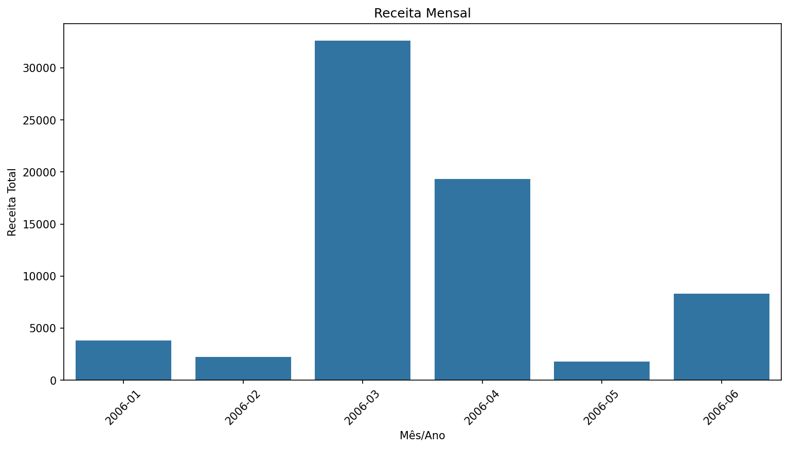
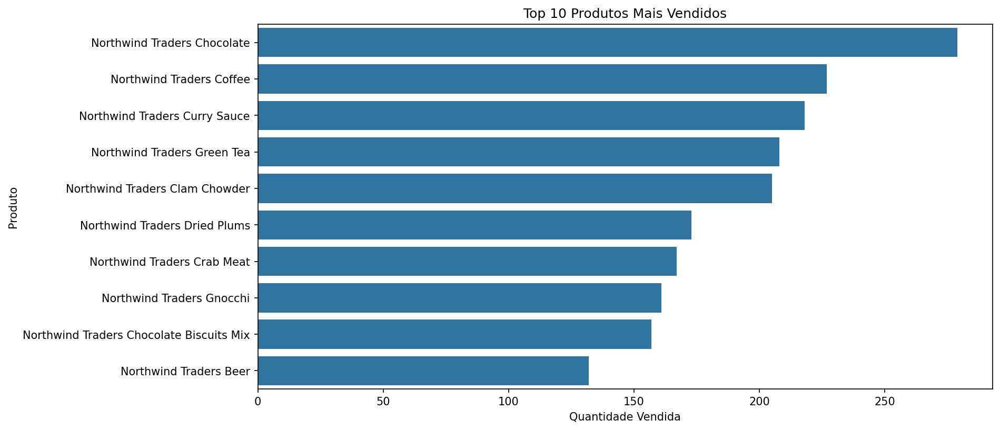
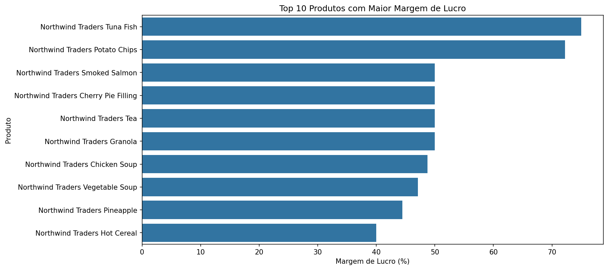

[README-5.md](https://github.com/user-attachments/files/28371992/README-5.md)
# Northwind Sales Analysis

## Sobre o Projeto

Projeto de análise de dados utilizando o banco de dados **Northwind** — uma empresa fictícia de importação e exportação de alimentos. O objetivo foi responder perguntas de negócio reais usando SQL, Python e Excel, transformando dados brutos em insights acionáveis.

---

## O que foi investigado

| Pergunta | Ferramenta |
|---|---|
| Quais clientes fazem mais pedidos? | SQL |
| Quais são os 10 produtos mais vendidos? | SQL + Python |
| Como evolui a receita mensal? | SQL + Python |
| Quais produtos têm maior margem de lucro? | SQL + Python |
| Qual funcionário gera mais receita? | SQL |

---

## Principais Descobertas

### A receita tem uma história a contar
Março de 2006 gerou **$32.609** — quase **4x** a média mensal dos outros meses. Um único mês não deveria dominar um trimestre assim. Esse pico levanta perguntas: foi um pedido em volume? Uma promoção sazonal? Os dados indicam que vale investigar.

### Chocolate vence em volume, Tuna Fish vence em margem
O **Northwind Traders Chocolate** foi o produto mais vendido com 279 unidades — mas carrega apenas **25% de margem**.

Já o **Northwind Traders Tuna Fish** lidera a tabela de margem com **75%** — vendido em menor quantidade, mas cada unidade é quase lucro puro.

A lição de negócio: *volume e rentabilidade não são a mesma coisa.*

### Dois funcionários sustentam o time
**Nancy Freehafer** gerou **$22.255** em receita — quase o dobro da segunda colocada **Anne Hellung-Larsen** com $19.974. Os outros seis funcionários juntos mal chegam perto dessas duas. Isso é um risco de concentração que merece atenção.

### A maioria dos clientes nunca comprou
A análise de clientes revelou que uma grande parte dos cadastros tem **0 pedidos**. Eles existem no sistema mas nunca converteram. Uma campanha de reativação poderia desbloquear receita significativa sem custo de aquisição.

---

## Stack Utilizada

```
MySQL 9.x        → Armazenamento e consultas SQL
Python 3.9       → Análise e visualização de dados
pandas           → Manipulação de DataFrames
seaborn          → Gráficos e visualizações
matplotlib       → Renderização dos gráficos
openpyxl         → Geração de relatório Excel
Jupyter Notebook → Ambiente de análise interativa
```

---

## Estrutura do Projeto

```
northwind-analysis/
│
├── analisenorthwind.ipynb   # Notebook principal de análise
├── northwind_relatorio.xlsx # Relatório Excel final (3 abas)
└── README.md                # Documentação do projeto
```

---

## Como Executar

**1. Clone o repositório**
```bash
git clone https://github.com/seu-usuario/northwind-analysis.git
cd northwind-analysis
```

**2. Configure o banco de dados**
```bash
curl -O https://raw.githubusercontent.com/dalers/mywind/master/northwind.sql
curl -O https://raw.githubusercontent.com/dalers/mywind/master/northwind-data.sql

mysql -u root -p -e "CREATE DATABASE northwind;"
mysql -u root -p northwind < northwind.sql
mysql -u root -p northwind < northwind-data.sql
```

**3. Crie o ambiente virtual e instale as dependências**
```bash
python3 -m venv venv
source venv/bin/activate
pip install mysql-connector-python pandas matplotlib seaborn openpyxl jupyter
```

**4. Abra o notebook**
```bash
jupyter notebook analisenorthwind.ipynb
```

**5. Atualize a string de conexão** na primeira célula com suas credenciais do MySQL.

---

## Visualizações

### Receita Mensal


### Top 10 Produtos Mais Vendidos


### Top 10 Produtos por Margem de Lucro


---

## Destaques SQL

**Receita Mensal:**
```sql
SELECT DATE_FORMAT(o.order_date, '%Y-%m') AS year_month,
       SUM(d.quantity * d.unit_price) AS total_revenue
FROM orders o
LEFT JOIN order_details d ON o.id = d.order_id
GROUP BY DATE_FORMAT(o.order_date, '%Y-%m')
ORDER BY year_month;
```

**Margem de Lucro por Produto:**
```sql
SELECT product_name,
       standard_cost,
       list_price,
       ((list_price - standard_cost) / list_price) * 100 AS margin_pct
FROM products
ORDER BY margin_pct DESC;
```

---

## Sobre

Projeto desenvolvido como parte de um portfólio de análise de dados, combinando consultas SQL, manipulação de dados com Python e storytelling de negócio.

**Ferramentas:** MySQL · Python · pandas · seaborn · openpyxl · Jupyter
